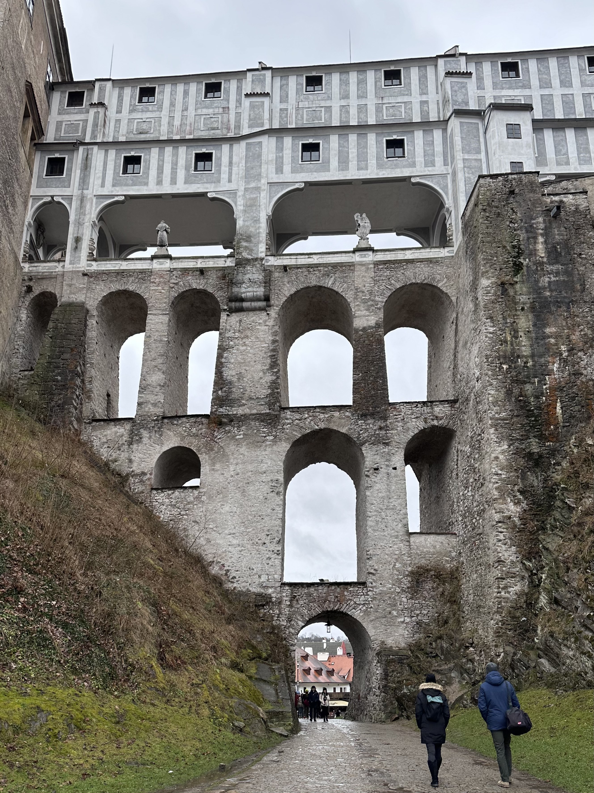
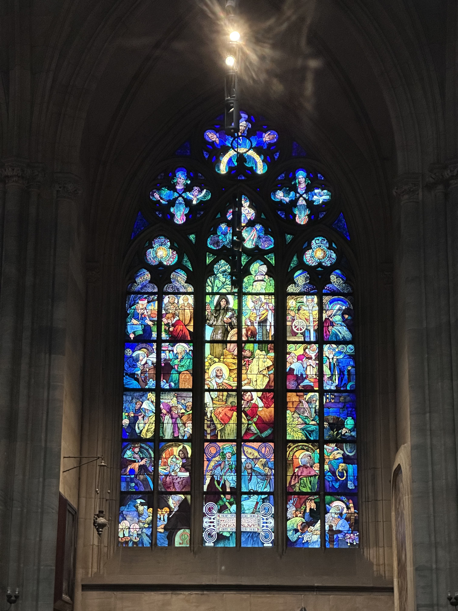
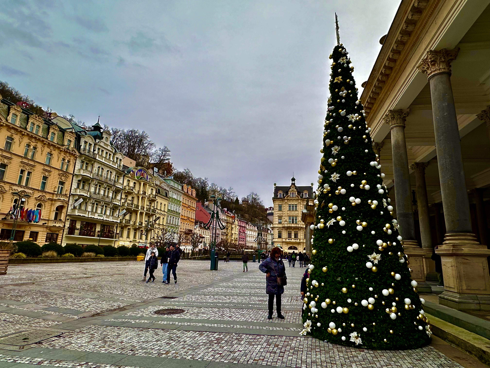

## 前言

安排了 2024 一開始去一直以來很想去的捷克，終於有機會嚐嚐聽聞許久類似於台灣食物的料理、還有一訪新藝術時期有名的畫家慕夏。因為不想為了多走幾個國家而淪於走馬看花的行程（另一方面，這個時候去匈牙利的機票太貴了），因此把足跡都留在捷克，多安排了一些小鎮的行程，也是很有趣！

## 預算

### 機票

ORY - PRG 來回 169.98€ `折合約 6700 台幣`

### 飯店（含城市稅）

| 城市 | 天數 | 價錢 € |
| --- | --- | --- |
| CK | 2 | 111.35 |
| KV | 1 | 99.6 |
| Prague | 2 | 125 |
| Airport | 1 | 96.7 |

平均 72.1€/ 晚 總共 216.4€/ 人 `折合約 7378 台幣`

### 交通

巴士 22€ (Prague-CK 來回 + Prague-KV 來回)

輕軌*4 4.93€  

總共約 27€/ 人 `折合約 921 台幣`

## 行程

> 📝 Day 1: 從巴黎飛到布拉格、再搭巴士到 CK 小鎮 (Český Krumlov 庫倫洛夫)
> \nDay 2: CK 小鎮
> \nDay 3: 一早搭巴士回布拉格
> \nDay 4: 布拉格
> \nDay 5: 一早搭巴士去溫泉小鎮 (Karlovy vary 卡羅維瓦利)
> \nDay 6: 中午搭巴士回布拉格、晚上搭公車去機場飯店
> \nDay 7: 回巴黎

### CK 小鎮說一生必去的城市好像有些言過其實

我們第一天就在 CK 小鎮落腳，也去了大家網路推薦、幾乎一致好評的地窖餐廳 Krčma Šatlava，不小心點了兩人套餐，上菜的時候真的不可思議，因為一份套餐只要 880 CZK ，但目測的份量大概四個人吃都綽綽有餘 … 有一個超大豬膝、豬肋條約 8 根、5 支雞翅?、2 隻大雞腿，還有一些馬鈴書跟蔬菜餅。毫不意外，勤儉持家的我們兩人把剩下的食物連同醬料都打包了。結果是吃到隔天還吃不完 = = 建議有打算要去的，如果不是超級特別愛吃肉，謹慎選擇。

因為接下來每一天我只要聞到有烤肉味，我整個人渾身不對勁、食慾下降 🤢🤢。捷克傳統料理的肉太多了，我看我還是先 pass 好了。

隔天我們花了約將近一天的時間在城裡逛逛，這個小鎮真的很小，店家彼此距離約 3 分鐘的腳程就可以走到。遠一點的一些城堡、塔的景點，從市中心出發也是在 15 分鐘內的閒晃就能走到。 可能是天氣因素加上這個城市有點小，整個城市沒有到非常令人驚艷。但登塔、以及在一些高地望出去的風景還是很漂亮，感覺得到老城保護的很好，捷克的老式建築也很有特色：紅瓦屋頂、圓拱形牆壁。

 

網路上查到太多資料說「此生必去」、「ＯＯ媒體推薦童話小鎮」，這類標題不禁把期望值拉得很高。也有可能歐洲真的太多所謂「世界最美ＯＯ」，確實 CK 小鎮很漂亮，我也覺得不虛此行，不過歐洲也有其他城市也是相同的特別與美麗。喔對了我真的要吐槽，有人還說什麼 CK 小鎮是布拉格近郊，巴士隨便搭單程兩個半小時起跳，都快到國界了，不要跟我開玩笑好嗎。

### 布拉格

第一天在布拉格有先快速吃個小點，找到一間這邊有名的連鎖速食店 `Baguette Boulevard` ，雖然取了一個很法式的名字 😂 最讓我驚豔的是裡面居然有賣自製的 iced tea，喝起來味道很淡（稱讚意味，歐洲普遍的軟式飲料實在都太甜了）、然後副餐有賣湯。我直接興奮到模糊、大點特點、喝到好感動！！！薯條也不錯吃，醬料給的方式很比利時（大方）。

後來有好幾天都是吃亞洲食物，因為我對肉肉料理實在沒有辦法。居然在下大雨的寒冷傍晚找到一間小火鍋 `Basu 巴蜀` = =，不小心開點後發現是網美餐廳（端來的肉盤還放了乾冰在冒煙），結果開吃之後直接不可思議，太好吃了吧 … 如果說在歐洲好吃的火鍋是海底撈，那這間就是最好吃的小火鍋（不是，我甚至沒有在法國吃過小火鍋誒）而且也沒有到很貴，可以點到的食材品質也都很不錯 … 忍不住再回味一下吃到茼蒿跟娃娃菜的感動瞬間。

最後一天在城堡區，決定再吃一次當地料理，結果一試，選到一間氣氛很好、服務生態度超級好、食物也不錯吃的 `Restaurace U Labuti` 。我點了在奧匈捷都還算蠻有名的炸雞排？還是炸豬排？ `Schnitzel` ，不錯不錯。推薦給怕肉肉全餐但又想體驗當地料理的人 XD

欸！怎麼都在聊吃的啦！

因為真的好便宜又好好吃，這一週旅行我還忍不住三進三出 `Comebuy` ，大吃珍珠，烏龍奶茶有夠好喝。🧋

#### 慕夏博物館

本趟旅行的重頭戲，其實比想像中還要再小一些。可以看的展品沒有到很多，動線設計也是普通，不過對新藝術有興趣的人我覺得實在不能錯過。看著這些精緻的廣告畫作，不難想像20世紀初世界一片和樂、蓬勃的光景。

如果有去布拉格的城堡區，千萬不要錯過裡面的教堂，其中一面玻璃畫是由慕夏負責，真的好美。

 

### 溫泉小鎮倒是不要錯過

這個城市的風景，我個人覺得大勝 CK 小鎮。CK 比較像是保存良好的老城區，KV 則像是童話小鎮，每個房子的顏色都很粉嫩，雖然天氣很差，但還是可以看到整個城市的風格非常和諧且舒適。

這裡也可搜集到所有捷克有名的有機保養類品牌 `Botanicus` 、 `Manufaktura` 、 `Apoteka` ，而且不會發生突然有一團亞洲觀光客如蝗蟲過境的掃盪商店、大聲喧嘩的場景，舒服。

我們在路邊真的捕捉到許多提供飲用、洗手的自然泉水，也看到很多路人去裝水來喝，而且還一臉津津有味、意猶未盡的樣子，甚至還拿寶特瓶裝一大堆。結論是不好喝、非常不好喝，供參。

## 捷克整體印象

### 街景

很多房子感覺因為觀光的關係，改造成類似博物館的內容，雖然內容很難引起一般人的興趣，但可以想像他們對觀光、文化的重視？

另一方面，走在路上會遇到不少美術工作室、畫廊，裡面的作品很有他們的特色，也有一般人買得起的作品 XD 整體的體驗很不錯。

### 人情

普遍來講，可能很依賴觀光加上捷克語偏小眾，用英文溝通都不是問題，只是有時候有些人臉真的好臭 🙈 原地嚇壞，但各地應該都是有友善的人跟機車的人，還好我線條很粗通常都沒有受到太大的影響。

第一天晚上我們剛抵達 CK 小鎮，還在車站邊走邊查路，突然一旁路人就跟我們說要往上面走。我們內心滿頭問號，想說他們怎麼知道我們要去哪裡 😂 後來猜到應該是因為我們一看就是觀光客，當地的好心人在烏漆嘛黑的路邊給看起來很無助的觀光客一點指引。（人好好）（愛心）

我們在 KV 逛街的時候，遇到了此生最友善、最大方的櫃姐，她瘋狂提供我們小樣，還讓我們帶回去試用一個晚上，毫無施壓的 sales 技巧，不得不讓我們隔天回去買一堆產品。（佩服）

### 飲食

飲料都沒什麼味道，像是 iced tea 以及這邊有名的 lemonade，顏色很鮮豔但喝起來實在很淡。另一方面食物都好鹹，像是吃薯泥的時候比較像在吃鹽巴佐馬鈴薯？

再次強調，內陸飲食習慣大概就是肉肉天堂，我自己覺得跟德國比的話又更肉肉（在說什麼）。

### 要不要換捷克克朗？

第一天我換了 30€ 以免不時之需，約接近 800 CZK。結果 7 天的行程，只遇到一個小攤販不收刷卡，大部分的店不僅接受刷卡、還接受歐元現金支付。不過匯率可能沒有到很漂亮，最漂亮的應該是慕夏博物館，1:24，其他店家大部分有 23 就了不起了。

所以需要的話頂多換小額，手邊持歐元的話甚至不用換匯也沒關係。

### 結論

在很多地方都會覺得不像是出國，因為路上實在太多…台灣人了…。就是當你走在路上，旁邊有一群人講話超大聲，仔細一聽發現這是熟悉的語言、甚至是熟悉的口音，不禁覺得有點好笑。然後還有聽到一些白目言論，不禁感嘆出國了也是要注意言行，不要因為語言不一樣就自以為可以肆無忌憚地批評另一個國家與文化呀。

這次去捷克真的看到跟西歐完全不同的風土民情、以及令人嘆為觀止的物價。這讓我迫不及待安排去其他國家的行程！！如果有機會，也會很希望可以有機會二訪捷克。
