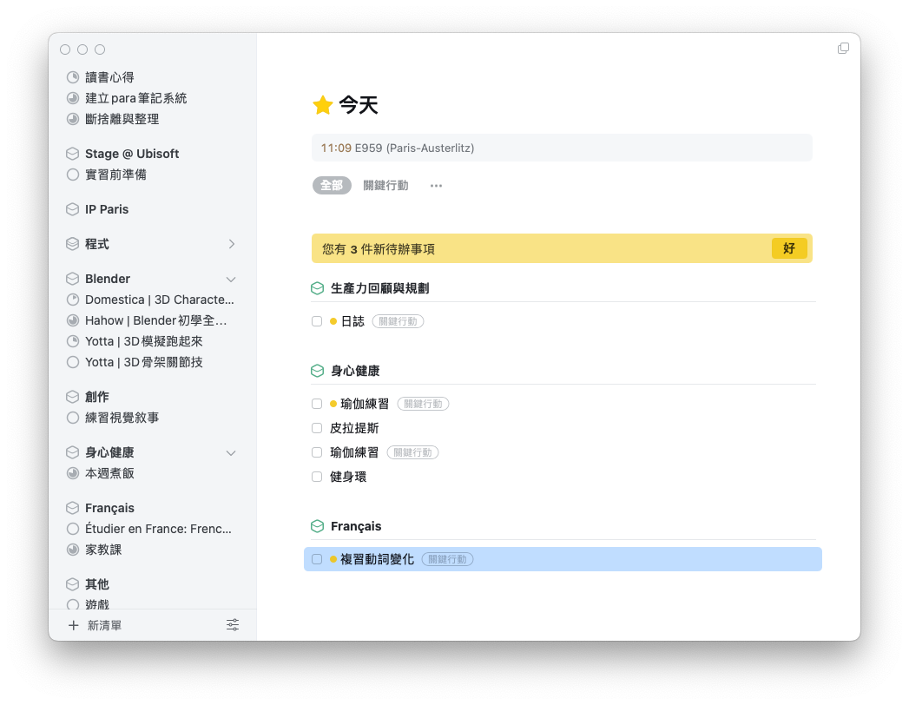

## 簡介

去年年底開始看這本書，不禁對新的一年充滿了希望。

在捷克的時候發現，自己有一個問題，就是注意力超級不集中 XD 這剛好也是這本書的一大命題：**每次做一件事的時候極度的專注在當下是高生產力、高效率的充分條件**。

> 📖 如今，最有生產力的人是那些從容行事的人；而要做到從容行事，最好的辦法就是培養、並維持強有力的專注力肌肉。
> 📖 

## 往內在探討動機——所謂高生產力的定義

> 📖 最具生產力的人，工作速度介於和尚和股票交易員之間：速度快到足以完成每件事，同時又慢到足以讓自己辨識最重要的事，然後**從容不迫且用心地執行**。
> 📖 

我很喜歡這本書的一個地方是，雖然歸類於生產力工具書，但作者的文筆很不錯，不僅提供實用的方法，還給我一種能見樹又能見林的感覺。一開始的這段話呼應到後面會提到的「如何提高生產力」，以及什麼叫做高生產力。

### 找到那些最重要的事

> - 📖 提高生產力的關鍵，在於創造出更多時間，讓你有餘裕進行實際上對自己有意義的事情。
> - 📖 這三項任務占所有工作的20％，卻帶給你至少80％的價值。「價值」這個詞在此非常關鍵：跟一般有意義的任務不同，這些具終極目標的任務不見得給你個人帶來很多價值或意義，但肯定會對你的生產力帶來極大的價值。
> 📖 

對應到許多其他生產力的書籍，似乎可以歸納出高生產力的究極定義： **我們不能創造時間，因此只能盡可能把時間留給那些最重要的事**。像是《生時間》所有的例子，都是在幫讀者節省下花在低報酬事務的時間，留給更有價值的事。而這邊的 *有價值* 不僅僅是那些有辦法量化的結果，像是工作、薪水、專案，能帶來價值的還有人際關係、熱情所在、提升心靈與生理健康⋯⋯。

## 所以其實會覺得時間變多了、精力變好了：「不那麼忙」？

> 📖 當你持續長時間工作，或是花太多時間忙東忙西，通常這並不表示你有太多工作要做，而只是意味著你並未明智善用精力和專注力。
> 📖 

大學時期的我，總喜歡追求很多 threads 同時進行的生活，最好一刻不得安寧，然後有種生活很繽紛、充實的感覺。我並沒有要否定過去的自己，畢竟我很珍惜有那段時間的摸索，但好像過了那段歲月後，若還是追求同樣的生活步調，反而會讓很多事情做不好。

當時能有很多能量去嘗試、去享受、去犯錯、以及去放棄。在體驗過許多不同領域後，找到自己有興趣的範疇、能夠探索更多有趣的 insight，然後*專注*於此，還能保有體力過著有餘韻的生活節奏。

> - 📖 只要有機會，最具生產力的人會優先管理好自己的精力和注意力，時間管理則是次要。
> - 📖 生產力並非指做得更多、更快，而是指用心嚴謹地做正確的事情。這就是為什麼騰出更多時間和注意力空間做事情會如此有效，因為這麼做能賦予你更多空間，做好更高回報的任務、避開低回報任務，而且變得更具生產力。

另一方面，如今的現代人大概都有落入社群媒體的陷阱過，不停的 scroll。我們都知道，這些對我們然後最後對導致情緒低落、生產力低落，甚至在兩者交互作用之下，還會產生一個惡化循環 😱 我想這本書之於現代人的用途，至少對我來說，某種程度上第一步就是從這個陷阱中解套。

> 📖 良好的生產力技巧大多有個奇怪的特質：當它們讓你每天完成更多事情時，卻往往讓你感到生產力變低。就像從工作中退一步去計畫、用較少的時間做事情，以及脫離網路等技巧，全都能幫助你完成更多的工作，但也會使你的工作不再那麼刺激，因而營造出一種錯覺，讓你以為完成的工作變少了。
> 📖 

### 我自己就是瞎忙冠軍

> - 📖 帕金森定律（Parkinson's law）指出：有多少可運用的時間，就會衍生出足夠的工作量來塞滿這些時間。在我的一年計畫裡，我發現這個定律特別適用於低回報的任務。由於你的大腦邊緣系統會抗拒做更具挑戰、最高回報的任務，因此低影響力的工作支援任務，幾乎就成為「工作迷幻藥」或「工作糖果」。當你在處理這些任務時，自然會感覺很有生產力
> - 📖 忙碌若不能讓你完成任何事情，那它跟懶散不做事又有什麼區別？
生產力與忙碌的程度或有多少效能無關，它只跟你完成多少有關。
單單只是因為你覺得有生產力，並不代表你真的有生產力。反之，儘管你富含生產力，你卻往往不覺得自己有生產力。

雖說大學時期我參加的活動多、還有課業、打工、出去玩什麼之類的，整體而言行程比較多，那時如果我比較難專心、效率比較差，好像還情有可原。也就是說現在，尤其是目前，我半年前辭去了打工後，生活只剩下研究所跟法文課，生活應該要變得比較輕鬆，時間會自然而然被「生」出來，但似乎也沒有 😂😂 甚至我在學期末只有兩門課，生活彷彿依舊還是被課業塞滿了。我做專案的步調變慢、專注度下降，因為我潛意識裡深知：**我時間很多**。

我做什麼都慢慢來，因為我不怕我的時間被浪費掉。

從一開始的真瞎忙，到現在是裝忙 😂 天啊！！能夠在新的一年開始閱讀這本書，也算是某種程度的幸運吧（比較有動力去面對問題，還可以趁機 set new resolutions）

## 透過安排任務與行程來達到自由

> 📖 簡化行事曆得以創造更多空間留給高回報的任務，如此一來，當臨時發生緊急事件需要處理時，你才有更充裕的空間足以反應。
> 📖 

看了這麼多本提升生產力、工作效率的書後，似乎終於瞭解到所謂 prductive 的本質。以前真的會因為行事曆被塞得滿滿的，到處東奔西跑，或是擁有很長的工時（至少是與薪資不成比例的工時 QQ）就認為自己做了很多事！而因此為自己感到驕傲。現在看來，以前每年都沒有達成的新年願望，就是在所謂「行程很滿」之下的犧牲品。我總會想，我真的沒有時間做這些事。但事實上是，我們應該要評估應該把精力、注意力、時間留給誰？

（新年新希望：好比說*把我買的一堆線上課程看完*，從來沒有，每年都在買，但從來沒有看完過！！）

> 📖 因為建立一份任務列表，就等於模擬完成實際工作──雖然什麼事都還沒完成，只是紙上談兵而已。
> 📖 

（是的，今年也再次把這個願望寫下來了，完成度會如何呢......）

### 實際的計畫

> 📖 野心大絕非壞事──你我都該如此，只不過，為了達成目標所採用的方式愈激進，你就愈不可能持續下去。
> 📖 

同一時間，我也剛重讀完《12週做完一年工作》，藉著新年的時機，幫自己制定了一連串的長短期目標，等晚些時間再來回顧、盤點，看看做得怎麼樣。這本書沒有很實際的說明要怎設置實際的計畫，在這部分比較接近老生常談，就推薦大家去看《12 week year》啦！

話說，如果從另一個角度，因為《12 week year》是屬於 top-down 的目標設置，搞不好也可以採用像是《原子習慣》這類 bottom-up 的方法，以免目標太過龐大 (which means, you should build a system here)

### 自主性

> 📖 生產力相關書籍之所以能吸引眾多讀者，是因為書中承諾能夠幫助我們重拾對所做一切事情的掌控權。
我喜歡那種「事情都在我掌控之中」的感覺。當我從腦海中清出所有任務、計畫，以及懸而未決的事情後，我獲得更多的注意力，足以專注在眼前的任務上，這讓我對於自己的工作有更大的控制權，並且讓我變得更有生產力。
> 📖 

**我超級喜歡做計畫。**

但此時這也是一個陷阱（對我而言）。

我容易淪為在做完計畫後就止步於此，沒有真實的行動...

### 承諾與初衷

在自主性與承諾與行動之間，《12週做完一年工作》給了很好的解釋，有絕對的自由與彈性，勢必相對的要持續跟承諾性的對自己問責。

> 📖 如果你不重視自己當下努力做出的改變，或是不清楚自己為何想要完成更多的深層原因，你當下就不會有動力做出短暫的犧牲，以達成長期的目標。

呈前段所說，我自己有一個很不好的習慣：**我只喜歡做規劃、不喜歡執行**。

想說這到底什麼鬼 XDD 我豈不成是什麼夢想家，其實根本沒有執行能力嗎!! 從另一個角度來看，我其實超級喜歡拖延，可能在某種程度上，當我做完安排之後我已經滿足了，潛意識沒有繼續堅持的理由（天啊，我的大腦好笨）

為此，我試過很多方法：看心理諮商、閱讀《拖延心理學》以及各種提升生產力的書、使用數位工具提醒自己、追蹤任務等。但大部分都失敗了，有時候有用、有時候卻會沒有用，這是為什麼呢？我最近找到了真正的原因。

## 好了！來做吧！

> 📖 生產力的技巧是用來幫助你更聰明地工作；但前提是，你得真正工作，不然再好的技巧也沒用。

看到這邊，我再次心有戚戚焉，忍不住為自己沒達成的目標找藉口：*我真的沒有時間做這些事啊啊啊*。

> 📖 《戰惰》（The Procrastinator's Handbook）一書作者麗塔．艾米特（Rita Emmett）總結得非常好；在她提出「艾米特定律」（Emmett's law）時是這麼說的：「害怕做某件事所耗費的時間和精力，比真正做那件事本身還要多。」

事實上，我超級愛拖延，有那麼多無趣的功課、乏味的任務，以及無人問責的項目。我在設置目標上總是充滿動力跟憧憬，但一旦完成之後，我再也不會打開我的記事本、notion 任務資料庫、 todo list 去檢查完成了沒，漸漸的，我的目標變得越來越難以企及。

> 📖 這正是為什麼要用心嚴謹工作，而非更快、更辛苦工作的另一項重要原因。藉由放慢工作腳步，你處理事情的思慮也會更加周延、覺知力更強；如此一來，當你眼前出現新的事情，你也更容易看清它能帶給你多大的回報。

對我而言，真正的問題是我覺得那些任務、那些被我排在行程裡的事都太無聊了。

> 📖 每當我嘗試一次只做一件事時，我總覺得自己好像錯過了什麼好玩的事情。

這應該是我從這本書最重要的 take-away，也是我今年真正的課題——**把專注執行變的好玩一些**。這也是我從這本書找到，我總是不行動、拖拖拉拉背後的真正原因，這些任務不好玩、乏味，光是想到就提不起勁，怎麼有辦法還勉強自己動身 *(真的是藉口一堆)*

> - 📖 唯有當你一次只做一件事時，你才能有足夠的注意力投注其中。
> - 📖 要把你在工作上投注的專注力從原先的53％，提高到80％或90％，並非一朝一夕就能做到，但它能帶給你意想不到的成效，非常值得你付出努力。
> - 📖 「人的思緒總是游移不定。」而研究證實：「游移不定的心思並不快樂。」從進化的角度來看：「具有思索非眼前發生事情的能力，屬於認知的高階功能，但它卻伴隨著情緒的成本。」雖然你的時間極其有限（所以生產力才會如此重要），但也正因如此，你更應該放慢腳步，在提高生產力的同時，全心全意享受這個過程。

因為我深深知道，光靠意志力是沒有用的。對我來說，我的意志力脆弱到連鼓勵自己下床的勇氣(?)都沒有，我平常要是想耍廢，是會躺平直到下午4點才勉強起床，因為實在太想尿尿了。*(沒錯好荒謬)* 如果想要達成成功的專注、進入心流，那就是讓做這件事情的本身變得有趣，讓我的大腦知道這件事的價值，以及當下是很好玩、很值得付出時間的！畢竟，人類的生理機制沒有那麼完整規劃未來的設計，更何況我注意力能集中的時間太短了。

> - 📖 一次只做一件事還賦予我更多的注意力空間，讓我更富同情心、更體貼，且更快樂。我強烈相信，一個人在努力提升生產力時，一定要具備豐富的同情心：不僅對別人慈悲，對自己也是一樣。
> - 📖 總之，要做到一次只做一件事需要某些調整，但我相信這麼做不僅可以幫助你完成更多工作，還能幫助你成為更好的人。

這方面，在我看諮商的時候、以及《拖延心理學》中都有提到。我常常為了很多事情而自責，即便我可能沒有意識到我正對自己感到不滿，但從很多情緒用字中，諮商師點出我對自己的苛責，有時候一些無傷大雅的紓壓方式可能真的就是好好放鬆、大吃一頓，這些都是沒關係的。舉例來說，因為我的拖延，導致很多事情沒有在第一時間完成，因此感到沮喪跟無力，更沒有動力去做。但追究起原因，我就真的不想做這些事情，拖延可能是壞習慣、但或許也是難免。我慢慢的在練習對自己說沒關係，知道背後的原因，能夠更理智的去看待事情。看得多、看得遠，自然就培養出了換位思考的能力。

在《12週做完一年工作》中的盤點章節中在在提到盤點的意義，並不是為了讓我們情緒低落、譴責自己糟糕的成效，而是能夠週期性的客觀評估。首先第一步就是，學會如何心平氣和的接受自己被打一個分數，然後藉此當作未來改正的動力。一開始我覺得很難，畢竟一個 40% 的成效擺在眼前真的不是很好看，但漸漸的練習就會理解到，人生就是這樣，起起伏伏，沒有辦法天天過年嘛！

> 📖 要克服負面的自我對話實在很難，但我內心有一部分就是相信：到最後，我肯定會沒事的。

### 正念、心流、冥想

最後，這或許是幫助專注力訓練肌肉的最佳運動，因此在許多生產力書籍都會提到的一個項目。

> - 📖 藉由正念和冥想，你將學會控制自己的專注力，進而投注更多注意力在眼前的任務上。
> - 📖 每天只要五到十分鐘冥想，就足以重新改造你的大腦，因而徹底改變你看待自身工作與生活的方式。雪倫採用的是切合實際的冥想方式，並將之視為從容度日、與自己內在連結，進而活出幸福人生的一種方式

我嘗試過幾次，但一般時候做總好像沒什麼幫助：我對練習呼吸、閉上眼睛專注在自己身上一點興趣也沒有。睡前的正念練習倒是讓我都睡得太快，還做不到一半就睡著了。

後來我開始做瑜伽，我依舊對練習呼吸沒有太大的興趣，但是每一次的伸展、不同的姿勢，我能因此而更專注在當下、在自己身上。甚至做完之後，我還感到心裡飄飄的，好像放下了什麼重擔，變得輕鬆了一些。

> 📖 正念能讓你從容做好眼前的工作，因為它讓你真正退一步思索想要達成的目標、領會你當下的感受，並瞭解你當下在想些什麼。據雪倫表示，這樣的機會每天多到無以計數：「在你談話之前、開會前或處理任何事情之前，不妨退一步，試著與自己的內在連結，看清自己想要什麼。譬如：你最想從談話當中看到什麼結果？然後朝那樣的結果努力，而不是任由你的感覺牽著鼻子走。」正念讓你每天隨時得以設定「微小計畫」，一整天累積下來，終會讓你變得更具生產力。
> 📖 

不管是提高生產力、調整作息、減肥、運動，所有他人推薦給我們的，最終都是要**自己去嘗試才能真正體會到適不適合自己**。

## 回顧

像是《刻意練習》一再強調的，不斷練習是不是正確的學習之路，而是要有意識的去觀察、調整自己的狀態；還有《子彈思考整理術》中提到的，把你所想要關注的記錄下來，若時時刻刻我們都能活在當下、定時回顧，那我們則永遠不會停下腳步前進。當然別忘了執行計畫或許最有效的《12 week year》。

> - 📖 這個方法的主要精髓，在於每週回顧一次熱點清單，想想你在過去一週分別花多少時間在上面，並想想未來的一週你打算關注哪些地方。
雖然我花了好幾個星期，才將各個熱點底下的承諾和責任全數列出，然而一旦完成之後，每當我望著這張清單，就能清楚看見我的人生風貌在我面前展開。
> - 📖 最具生產力的人與其他人不同的地方在於：他們每個星期都會修正方向，一步步把事情做得愈來愈好。

## 實際應用與連結

### 節錄書中列出的挑戰

> 📖 你應該在下班前，或是上床前，就先決定隔天要達成的三項目標。
> 📖 

大部分的挑戰我覺得都很實用，操作起來也很容易，我覺得光是為了這些挑戰，就很值得入手這本書。
所有的挑戰其實也都可以跟其他書籍相關聯：如每日三個重點、保持好精神可以對應到《生時間》、利用黃金時段工作可以對應到《12 year week》、捕捉以及熱點可以對應到《搞定》。

### 《生時間》與 Things 3

> 📖 後來，我想到一個建立計畫總清單的簡單方法，亦即把它們與熱點結合，將所有計畫分門別類歸在各個熱點之下。（如果你一翻開本書就看到這一頁，這幾句話應該會讓你一頭霧水吧！）就像創立一個隨時可供檢視的熱點清單一樣，這張清單簡明易懂，但非常有效。

看到這邊如果你覺得太抽象，那建議你看《搞定》這本書，裡面歸納任務、分配時間的說明寫得非常好，後來我甚至因為漂亮的介面去買了 things 3，我覺得很好用，真的是幫助大大，自從我習慣把要做的事情打進去之後，就真的再也沒有忘記該做的事。
書中提到的熱點就是 things 3 裡面的「領域」，可以幫助使用者分門別類該做的任務。使用簡單、同步性好、介面漂亮，推推！

## 總結

> - 📖 追求生產力的過程，往往也是認清自我極限的過程。
> - 📖 能否每天從容嚴謹且意志堅定地做事，決定生產力的高低。不過，找出背後的深層意義也同等重要。你行動背後的意圖就像是連接箭頭的箭桿，若你不深入探索自己內心深處為何想要完成某一件事，便很難日復一日提升自己的生產力。這個生產力觀點是本書截至目前為止最不迷人的忠告了，但它應該是最重要的。若是你不在乎自己究竟想做出什麼改變，就算你投入無數的時間提高生產力，或是培養新的習慣，都是徒勞；因為你不會有動力長久維持這些改變。

去年在辭職之後，終於把精神跟體力贏了回來。以前我總說「沒有時間」、「沒有力氣」，那些話都是真的。因為打工的體力活實在是太累人了，我已經沒有一絲絲力氣坐在書桌前，學新東西也好、寫日誌也好，任何有真實 input/output 的活動我都沒有辦法做了，我的體力沒有辦法支撐我的注意力跟心思，我只能坐在沙發上、躺在床上享受電視跟社群媒體帶給我的無腦的快樂。

而如今，我有辦法提筆，邊想望著我的未來，提筆寫下意圖 (intention)、目標、計畫......，然後漸漸地朝著目標前進。

### 生活品質與生活本質的核心

> 📖 我很快就意識到，身邊的人不光是我計畫存在的理由，而且是我計畫存在的目的。是這些人給了我努力的意義，而且我至今所做的每一份工作，這些人也賦予了它們意義。
正因為身邊的人，我們才會做現在做的事情，他們也是推動我們完成更多成就的關鍵。與其他人維持良好的社交關係，已被證實能讓我們更幸福、更投入工作，並且想要提高生產力。
總而言之，人是追求生產力的背後原因。
> 📖 

我以前從未這麼想過，甚至還會覺得維持好習慣、高生產力，都是一種在競爭環境之下的產物，除了提升競爭力之外沒有其他的好處跟動機。但其實不然，想想也覺得蠻合理的：當一個人的身心靈狀態好，沒有過多的社會壓力，我們自然能選擇理性、善良、寬容。

> 📖 因為大腦無法分辨觀想與實際經驗的區別，因此你在回想時，等於讓最有意義的經歷重複發生。日積月累下來，你的大腦便將這些點連接起來，形成一條軌跡，讓你相信自己的人生深具意義。
> 📖 

這本書的金句書摘實在太多，因為電子書畫線的功能很方便，我就一時畫線一時爽、一直畫線一直爽。真的是一本閱讀時看了會頻頻點頭，之後回想還是會覺得很有收穫，實作上來也很有幫助的一本書！