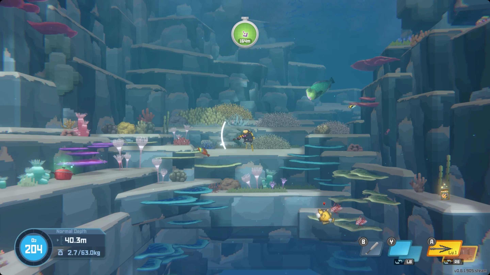

去年結束的時候，我很用力地回顧了 2024 一整年的人生結算，還是忍不住希望以職涯與成就去定義過去這一年是否豐收。先說結論，每一年都結算得好狼狽，因為這並不是我個性與生活的模樣。總之，今年希望可以更誠實的面對自己，然後真實的去培養那些擱在心裡一直想學的酷東西。看在工作之餘，我看似無聊的生活可以長出哪些 branch。

## Side projects
### Where is Bijou
開始上班加上寫手帳後很踏實的感受到一天可用的時間其實蠻多的，終於不用上一天的學後還要回家熬夜趕作業。不知不覺中貪心的個性已經為目前的生活增添了很多 side project，像是 [where is Bijou](https://miyaya.github.io/p/react-hook-%E4%BB%8B%E7%B4%B9%E9%80%8F%E9%81%8E%E8%B8%A9%E5%9C%B0%E9%9B%B7%E5%B0%88%E6%A1%88%E5%AD%B8-react/) 是我一邊學 React 一邊做出來的小專案，花了約三、四天配著 chatGPT 寫出來的，雖然因為是學習型專案所以文章寫得比較亂，但這個起頭讓我覺得寫前端蠻酷的，現在真的每天工作都在碰，算是滿足了當初寫後端時的好奇心。

### Divvywise
年初去完一趟布達佩斯後，又想起每次出去玩都有的煩惱：因為我主要用歐元跟台幣、kiki 用英鎊跟台幣，同時我們的消費是匈牙利福林 (Ft)，整個計算變得很複雜，雖然我們每次都蠻佛系在算的，但我總想說如果可以做一個 app 解決這個問題那該有多好。礙於目前我還不會寫 mobile app，就先用網頁開發，還可以順便練習 UIUX、 vercel 部署，目前的進度很慢，主要的問題之一是頁面實在是太醜了，希望近期可以把這個克服！

### Group project
雖然我覺得光這兩個聽起來就有點忙了，可是因為我還是很想寫後端、最好可以碰到雲的東西，所以在網路上因緣際會找了一個 side project group 加入，甚至還需要面試，我覺得蠻酷的。雖然他們的點子跟我另一個點子蠻像的，讓我不禁手癢想趕快落實我的點子（算是個 social media platform），不過我實在沒有辦法再撥時間出來給一個專案，可能未來吧...

## 想變得更有趣
之前在 Ubisoft 實習的尾聲，主管寫了一份我的實習報告，我們一致都覺得我在 demo 上不夠有創意、會太容易以工程師的角度去描述「開發了什麼」、「實現了什麼功能」，而不是從使用者出發去看需求、然後延伸去討論、展示 feature 的彈性跟極限。

我覺得這件事對以前的我來說可能無所謂，因為寫後端或是寫邏輯哪有差，如果團隊都是工程師那也沒關係，但我現在的角色往前走了一些，我也希望自己可以有更好的 capability 去觸及設計一個產品時應該要設想得到內容。希望在 demo 的時候、在開發的時候都再更有人性一點。

要做到這件事我覺得應該有很多種方法，首先最簡單的應該就是多看、邊看到的時候就思考。我希望未來的我是一個有有趣點子的人。

首先先讓生活多一點娛樂、多一點樂趣。我想說從我一直以來都喜歡的 3D 和因為實習而開始關心的遊戲開始。

### Blender
要說我買過形形色色的線上課程中，`Blender` 應該是最大宗沒有之一了。

從 hahow 跟 YOTTA 上面的小深藍，到 PPA 的木木，到一些獨立開課的創作者，我全都有買 XD 但看完的只有 hahow 的小深藍小火車，而且成品還不盡理想 XDD

去年 12 月底終於開始因為加入了木木的新課程募資，所以開始看他的舊課程。發現很多細節她都省略沒有解釋，有點開心自己的程式跟數學底子終於累積到了一個地步，我可以開始能自動想像這些功能是如何被完成，以及他們是想要解決哪些問題！然而進展到開始需要加入自己的創意的部分的時候，我就會卡住，因為我會想說要自己動手做做看、設計看看，不想只是跟著課裡的範例，但有點茫然（不知從何做起）就會無法往前推進度。現在轉換到 Zack 的課，希望可以換個情境，看能不能透過把底子打好來建立更多靈感與想法。

最終希望做一些有趣的東西，然後結合 three.js。

### 遊戲們

[source: polygon review Dave the Diver](https://www.polygon.com/reviews/23777236/dave-the-diver-review-management-sim-steam-pc)

去年從台灣回巴黎的時候，我在機場買了一張 Dave the diver 的遊戲片。我觀望這個遊戲很久了，一玩驚為天人，簡直了！！！有搜集卡牌遊戲的樂趣，但也有主線的任務感、畫面很漂亮，常常有有趣的小支線，整體難易度適中、想放鬆玩經營餐廳的線也沒有問題！於是我天天玩、日夜玩，週末玩、熬夜玩。

超級好玩，救命。

夏天我玩了紙片瑪利歐 RPG，我很喜歡，然後聖誕節後得到一張 outer wilds 的遊戲片，希望哪天準備好了可以來玩。玩遊戲是我去實習之後意外喜歡上事情，可以偶爾玩遊戲、沈迷於遊戲，我覺得真的是一件蠻幸福的事情。

### 書
去年看了 14 本書，我對看書其實沒有什麼目標，就是快樂就好，阿買了的書要記得看，就這樣而已，去年買了太多書，今年再來慢慢看完。
|書名|評分|小記|
|---|----|----|
|最有生產力的一年|5||
|⭐️ 12 週做完一年工作|5|聽完有聲書後買了翻譯版，真的很有效地幫自己目標建立 sprint，雖然我個人的完成度總是不太好，不過作為一個生產力系統，這已經是對我最有效的了|
|最高學以致用法|3|偏無聊|
|世界太無聊，我們需要文藝復興|4|蠻有趣的書，從聊八卦的角度認識藝術史很快樂|
|剛剛離開的世界|3||
|發現我的多重職涯組合|4||
|閒人出租|4|蠻有趣的題材，可能不算小說，是在講作者把自己租出去的故事|
|溫泉鄉青春曲|5|三蒲紫苑的新作，反常地講職人跟夢想的相反——一個沒有夢想的學生的生活故事，溫馨可愛的小品，只能說三蒲的書真的品質保證|
|🔖 詭畫連篇|5|帶插畫的懸疑鬼故事，看了膽戰心驚，故事簡單但我很喜歡講故事的敘事角度，會越看越快因為想知道後面發生了什麼|
|恆毅力|5||
|⭐️ 1 天 1 行小日記，寫出超強行動力|5|透過簡單的方式更有意識的回顧生活，雖然很容易完成但成效出奇的好！|
|夠好的工作|5|適合開始在上班時間思考人生的人，像我|
|世界盡頭的溫室|4|金葉草的長篇小說，但我好像比較喜歡他的極短篇|
|⭐️ 高成效習慣|5|系統性的定義「高成效」是什麼，並根據具體的指標去優化，照著思考跟執行感覺真的可以達到長期的成功與幸福|

⭐️ = 推薦的非小說；🔖 = 推薦的小說，真的很好看

一年過後再來回顧看過的書，有些書已經忘記裡面在寫什麼了。看來適度的寫 review 好像是必要的。

## Apps

### One year

這是這篇文章的封面，也是今年新推出的 app，作者 [Alec](https://x.com/alec_dilanchian?mx=2) 和 [Sam](https://x.com/samdape) 認為我們現在的生活太快速，想要推出一款 widget 來提醒一年中還剩下幾天。非常可愛的手繪 ui，程式方面感覺並不多，作者也有提到寫得不多、大部分都是 prompt 出來的。這種可愛、獨特的 app 實在太深我心...

### Rize
總結以上，我在正職之外還有生活、又貪心的想要完成很多事。因此，生產力與時間安排便成了一個真正需要討論的議題。說我是幸運吧，在聖誕節期間，因為看到 M4 加教育價太香了忍不住購入，順手看了很多好用的 app 推薦，我在此時載了 [Rize](https://rize.io/)，簡直驚為天人，雖然經考量我一天大概只會用 2-3 小時，所以試用完後就沒有再用付費版，但功能跟介面真的都是一流的體驗，如果我個人使用時間拉長那就會考慮訂閱，在此推推！

## 總結
2025 依舊是個貪心的一年，但第一個月的進度還不錯——雖然慢，但有在前進，而且終於體驗到了在職人生，每天都千方百計設想如何過好玩的生活，然後最好能早點退休。