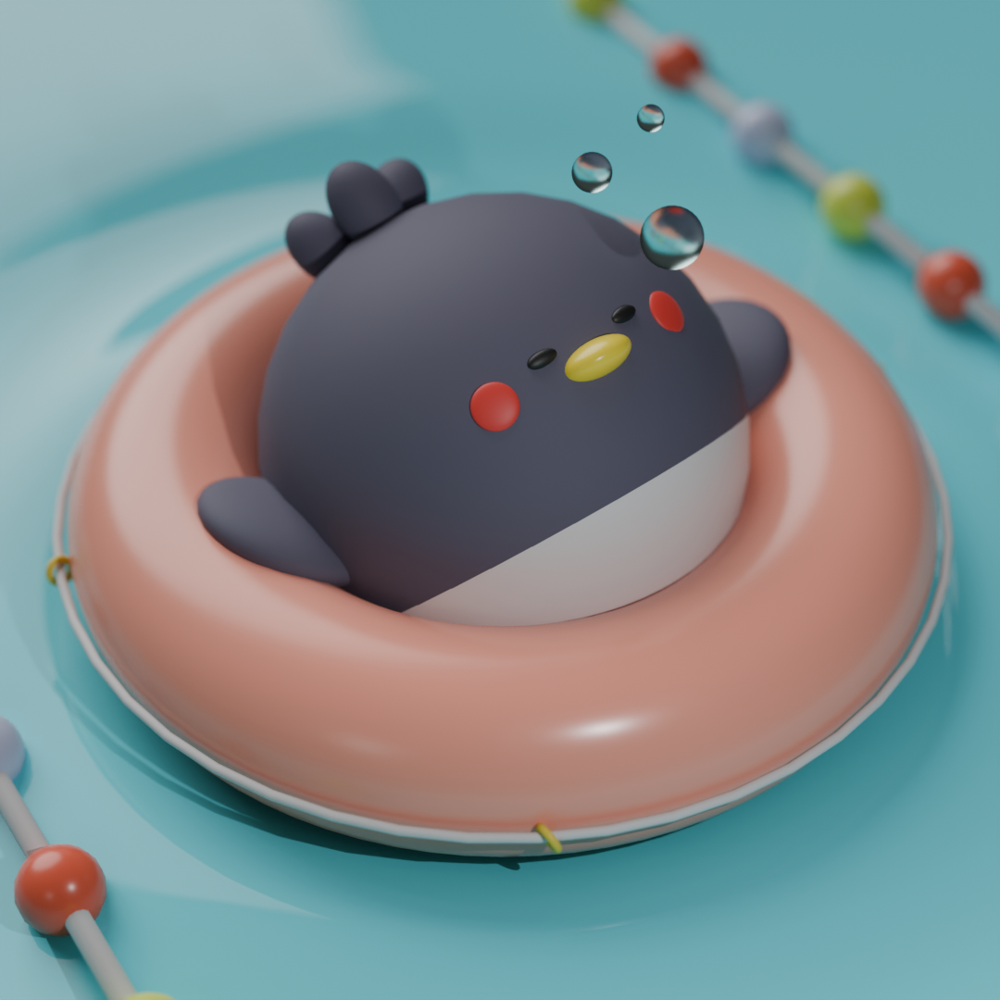
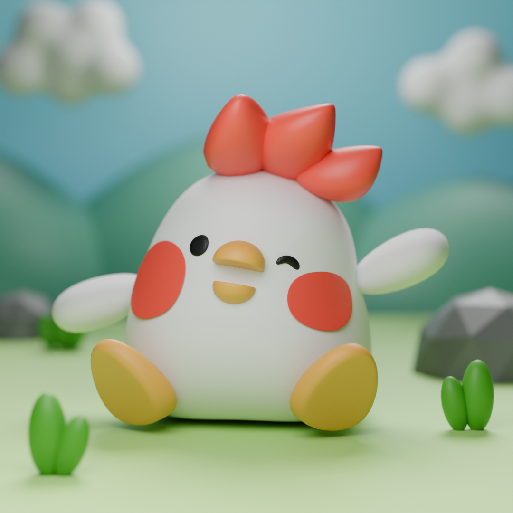
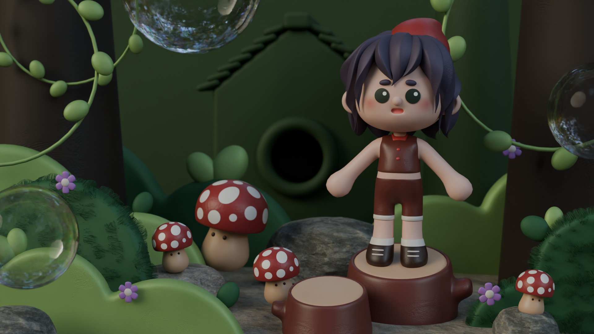

暑假到了，巴黎雖然也難逃熱浪的影響，但空蕩蕩的城市總讓人特別珍惜。

最近無意間翻到自己年初寫的文章，覺得有些當時寫下所想要發展的專案，日前稍稍改變了一些。因此想藉著這個機會來更新一下近況，以及最近的想法。

## 關於減肥
減肥這事，不說還好，一但立下了「我要減肥」的心願，往往是越減越肥。比起年初，我好像體重上沒有變化，但實際上所經歷的是一度 +2 公斤，好不容易才降到年初的體重，而年初的體重離理想還差了 5 公斤⋯⋯不知道回台灣前有沒有辦法瘦一點下來，畢竟每次回去，就算我已經對身材很佛系，還是難逃被唸、跟別人比較的心態。我媽甚至覺得我變胖是因為我生病了？？想知道我到底是有多胖才可以有這種結論 😀😀 ？

但是我最近看了阿斷的日更 100 天減肥影片，甚至還有粉絲把每天阿斷吃的[食譜](https://docs.google.com/spreadsheets/d/16X3TQecqbodT9nsYHYhW_6YLK-8dO9ioKm2xwIFCHhM/edit?gid=0#gid=0)整理成試算表。看了真的是非常勵志！害得我也去找 Claude 生成 60 天的減肥計劃 XD (因為我太了解自己三天捕魚兩天曬網的個性，100 天一定是沒耐心的，要是真的能撐 60 天就阿密陀佛了) 但至今都還沒有展開，希望這個月有勇氣開始⋯⋯並持續到回台灣。

### 羽球
去年因為看了奧運羽球賽，非常熱血！！跟 Romain 心血來潮買了羽球配備、租了場地，結果一整年下來應該去不到 10 次。雖然以我們的惰性，這樣的結果並不意外，但對於生活平常感到疲憊或是生病的次數真的是意外的高，總覺得在運動這方面有時候有點心有餘而力不足，只好再多看幾次阿斷減肥影片來勵志自己(?)

## 人生計劃
### 買房
去年一個衝動看的房子、一個衝動就買了。今年開始跑貸款、做客變、跟建設公司吵架、跟貸款銀行吵架。

### 生小孩
前陣子我們去探望朋友與他一歲多的寶寶，我們上次看到寶寶的時候，她才幾個月大，除了吃跟睡之外什麼都不會。這次已經會哇哇作響 (?)、會走、會跑、會爆衝，但因為寶寶的個性很好，我整個愛她愛到不行，雖然她很重但還是會很想抱她、跟她玩，或是看她玩 / 被她玩；反觀 Romain 就不是這樣，他總是在一旁神情緊張兮兮的樣子，彷彿花了很大的力氣把崩潰與尷尬壓在內心深處——欸不是，這位先生什麼都沒做，甚至還跟寶寶保持一個安全距離，彷彿在觀賞某種異於人類的生物。

我看他對小孩是完全沒輒，而且光是作為一個旁觀者就足以使他感到疲憊不堪 (???) 我真的快笑死。他對小孩排斥的個性大概會是一個我們人生中決定（不會）生小孩很大的變數。雖然我一邊覺得有點可惜，好像人生會少一種體驗，但另一邊又覺得我可以因此去擁有更多時間嘗試與體驗那些我至今仍未、但還很想做的事。

我們對此仍持保留態度，哪天誰改變心意我們也有彈性，不過目前這樣我們都覺得很好。

## 動畫
雖然最近沈浸在 vibe coding 的喜悅中，但前陣子有好好的把時間投資在動畫上。感謝[木木動畫課](https://www.pressplay.cc/project/0ECD95E1D1F9DB053E843759637364A9/about)的《獎學金計劃》，讓我為了 1000 塊非常努力的每天做作業。我還應用了在[愛紗實用日文課](https://shifu.tw/courses/japanese)裡頭的《Notion 40天學習計劃》，幫自己排定約25天的計劃：每日完成一點點課程或是一點點作業進度，成效可以說是非常ㄉ好！因為每天的量不會太大，整體的進度也不至於拖到一個月以上，期間剛好也沒有什麼假期或出去玩，在非常專心的情況下完課了。我還摸了一點別的課的學習內容，Zack的角色課、曾右任的 3D 風格課⋯⋯。來放一下我這半年來的練習，希望下半年還有機會可以再做角色跟動畫。

 

 

## 更好的工作 vs 夠好的工作
最後想用工作來作為結尾，因為我每個禮拜至少都會花個一兩天吵著**不想工作**，早上起床時尤其顯著。在此我先把工作與上班畫上等號，因為我（還）沒有辦法不上班只工作就有收入。

### 更好的工作
直至今日，我還是時不時會打開 chatGPT，詢問我的未來運勢——看我有沒有辦法去規模更大的公司、有沒有機會自己出來接案、能不能去做動畫做遊戲、或是更多的職涯可能性。
我發現我總是想探索更多，我到現在做過無數個實習與 junior 職位，但我還想繼續探索，好像我對現況永遠沒辦法滿意，我還是很好奇「如果換成做ＯＯ感覺也很好玩」。

### 夠好的工作
總覺得自己還年輕，因此想多探索，說是這樣說沒錯，但我彷彿忽略了我或許已經花了足夠的時間在探索。

有天在我大談我如何想當 DevOps 但 chatGPT 說我不適合時，Romain 終於受不了我對未來的想像三天一小改、五天一大換的態度，問我難道不喜歡現在的崗位與工作內容嗎？直說若我喜歡，應該要想辦法發展出更專業、資深的能力，換取更好的機會（薪水、職位、甚至跳槽）。 
剛好最近時逢 it 鐵人賽，我每年都想參賽 (甚至還想望得獎出書的那種)(做美夢的部分可能真的是第一名)，但沒有一次成功 XD 今年突發奇想——要學的東西這麼多，不如不要再寫新東西，也不要寫程式，以「觀念」為主，幫自己主題式的學習、釐清概念與用法。多虧了 LLM 的蓬勃發展，省下了很多查資料跟閱讀文獻的功夫，還免去了可能最終還是看不懂的困境。

不過會不會寫完，還是得到實際寫了、報名了、發文了才知道。這麼多年來，我越來越了解自己的部分就是**實際做了才算數**，想想的部分也只能算想想而已。

## 許多懸念
目前很多事都在進行中，希望到年底就可以水落石出，看到些許進步與成果。

最後，入職一來想寫的東西終於快寫完了 (再次多虧 AI 的幫助，真的是邊寫邊學，感恩 AI 讚嘆 AI)，入職時給自己許下了要努力升遷的想望，等把這個 repo 提交出去，不知道有沒有辦法因此而加薪。