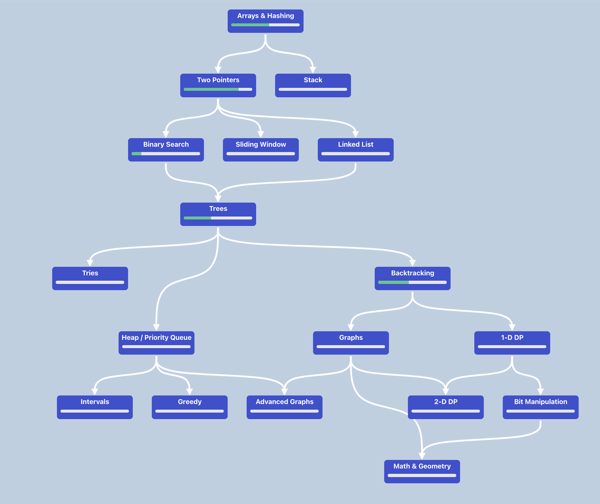

## NeetCode 250

上次找實習的時候因為覺得時間沒有很夠，所以刷了 `Blind 75` 就上戰場了 XD ~~不過事實證明只要有運氣，刷題可能不是那麼重要~~(並不是)

這次因為不想經歷刷題的時候很痛苦的過程，想要尋找一種**輕鬆刷題的途徑**，覺得 NeetCode 250 好像是一個很不錯的組合！由 NeetCode 150 + 100 題 easy / medium 組成，我覺得更能幫助在練習的過程中訓練信心 XDD


沿著 roadmap 慢慢寫，今天來到了 backtracking，算是為 graph 與 dp 做第一步的準備。

## Backtracking 終極模版

backtracking 因為是某種程度的暴力解法（就真的需要遍歷），所以相對來說寫法跟演算法都蠻單純的，只需要注意終端條件與一些小細節，如排序後可以提早跳出迴圈等優化。

```go
backtrack(參數) {
    if 終止條件 { 保存結果; return }
    for 選擇 in 選擇列表 {
        做選擇
        backtrack(新參數)
        撤銷選擇
    }
}
```

## 組合 Combination

### 模板

以 [1863. Sum of All Subset XOR Totals](https://leetcode.com/problems/sum-of-all-subset-xor-totals) 來看，每個元素有 2 種選擇（拿或不拿），當我 `index` 指標走到最後一個的時候代表比完了，可以把數字加總起來。

```go
var backtrack func(index int, currentXOR int)
backtrack = func(index int, currentXOR int) {
    // 遞迴結束條件
    if index == len(nums) {
        totalSum += currentXOR
        return
    }
    
    // 不選當前元素
    backtrack(index+1, currentXOR)
    
    // 選擇當前元素
    backtrack(index+1, currentXOR ^ nums[index])
}
```
### 複雜度分析

**時間複雜度: O(2^n)** 因為前面提到每個元素有拿或不拿，且進行 XOR 計算的複雜度為 O(1)。
**空間複雜度: O(n)** 因為遞迴迭代的 stack 深度為 N。

### 去重
如 [40. Combination Sum II](https://leetcode.com/problems/combination-sum-ii/) 中的測資 `candidates = [2,5,2,1,2], target = 5`。

首先我們先排序，那 `candidates = [1,2,2,2,5]`，如果沒有去重的話，最後的結果會變成

```text
result = [
    [5],      // ✓ 正確
    [1,2,2],  // ✓ 正確
    [1,2,2],  // ❌ 重複! (來自索引 0,1,2)
    [1,2,2],  // ❌ 重複! (來自索引 0,1,3)
    [2,2,2],  // ❌ 錯誤! sum=6 > 5
]
```

當我們在元素有重複的情況下，會需要加上這一段程式碼去重：避免如果把當前的 2 拿來用，且前一個元素也是 2 而發生重複的情況

```go
if j > i && candidates[j] == candidates[j-1] {
    continue
}
```

> 注意這邊的**跳過**，是指「只跳過同一層的重複」！
>
>「不同層」使用相同數字，依然是合法的！

```text
                          [] (start=0, sum=0)
                          |
        ┌─────────────────┼─────────────────┬─────────┐
        ↓                 ↓                 ↓         ↓
      [1]               [2]              [2]跳過    [2]跳過   [5]
   (start=1)         (start=2)          (j=2)      (j=3)   (start=5)
    sum=1             sum=2              ↑          ↑       sum=5 ✓
        |                 |              |          |
        |                 |          因為 j > start(0)
        |                 |          且 [2]==[1]? No
        |                 |          且 [2]==[2]? Yes! 跳過
    ┌───┼───┬───┐     ┌───┼───┬───┐
    ↓   ↓   ↓   ↓     ↓   ↓   ↓   ↓
  [1,2][1,2][1,2][1,5][2,2][2,2][2,5]
       跳過  跳過          跳過
   s=3  (j>2)(j>2) s=6  s=4  (j>3) s=7
   i=2  且==[2] 且==[2]   i=3   且==[2]
    |                      |
    ↓                      ↓
 [1,2,2]                [2,2,2]
  s=4                    s=6
  i=3                   (超過target)
   |
   ↓
[1,2,2,2] 跳過 [1,2,2,5]
  s=6              s=9
 (超過)           (超過)
 ```

## 排列 Permutation
在排列問題中，通常會需要遍歷所有的可能性，透過 backtracking implement 以下的流程，可以系統性地探索所有可能性：

1. 選擇 (Choose): 做出一個選擇
2. 探索 (Explore): 遞歸探索該選擇的後果
3. 撤銷 (Unchoose): 撤銷選擇,嘗試其他可能性

以 `[1,2,3]` 這個簡單的例子來說，就會是這樣的流程

```text
選擇 1 → path = [1]
選擇 2 → path = [1, 2]
選擇 3 → path = [1, 2, 3] ✓ 找到一個排列!
回溯: 撤銷 3 → path = [1, 2]
沒有更多選擇,回溯: 撤銷 2 → path = [1]
選擇 3 → path = [1, 3]
選擇 2 → path = [1, 3, 2] ✓ 找到一個排列!
... 繼續直到所有分支探索完畢
```

### 模板

```go
func backtrack(nums []int, path []int, used []bool, result *[][]int) {
    // Base Case: 當路徑長度等於原數組長度時,找到一個完整排列
    if len(path) == len(nums) {
        // 重要!必須創建新切片,否則後續修改會影響已保存的結果
        temp := make([]int, len(path))
        copy(temp, path)
        *result = append(*result, temp)
        return
    }
    
    // 遞迴情況: 嘗試每一個未使用的數字
    for i := 0; i < len(nums); i++ {
        if used[i] {
            continue
        }
        
        // 1. 做選擇 (Choose)
        path = append(path, nums[i])
        used[i] = true
        
        // 2. 遞歸探索 (Explore)
        backtrack(nums, path, used, result)
        
        // 3. 撤銷選擇 (Unchoose) - 回溯的關鍵步驟!
        path = path[:len(path)-1]
        used[i] = false
    }
}
```

### 複雜度分析
**時間複雜度: O(n! × n)**
- `n!` 種排列組合 (n 個元素的全排列數)
- 每個排列需要 `O(n)` 時間複製到結果中

**空間複雜度: O(n)**
- 遞迴調用棧深度: O(n)
- `path` 數組: O(n)
- `used` 數組: O(n)

### 進階版: 含重複元素的排列

這個版本中，最重要的邏輯是要避免重複排列，而去重邏輯依賴於相鄰重複元素，所以首先要先排序，之後遞迴的時候才能正確識別和跳過重複元素。

```text
                 []
        ┌────────┼────────┐
       1₁       1₂(跳過)   2
     ┌──┴──┐               │
    1₂    2              1₁,1₂
    │     │              ┌─┴─┐
  1₂,2  1₁,1₂          1,1,2  1,2,1
    │     │                    (跳過)
 [1,1,2] [1,2,1]              [2,1,1]
```

以上面的例子來看的話，1₂ 在同層出現時，1₁ 還沒被使用(used[0]=false)的話則跳過 1₂，就可以避免有重複的 `[1,1,2]`, `[1,2,1]` 結果。

```go
// 如果當前元素與前一個元素相同,且前一個元素未被使用,則跳過
// 這確保相同元素按順序使用,避免重複排列
if i > 0 && nums[i] == nums[i-1] && !used[i-1] {
    continue
}
```


## 結語 - 排列 vs 組合

跟 combination 相比，因為 permutation 不是線性的遍歷，因此需要去記得是否該元素有被使用過 `used`。

```go
// 排列問題需要遍歷所有的順序，因此不能限定單一的線性方向
func permuteCorrect(nums []int) [][]int {
    result := [][]int{}
    path := []int{}
    used := make([]bool, len(nums))
    
    var backtrack func()
    backtrack = func() {
        if len(path) == len(nums) {
            temp := make([]int, len(path))
            copy(temp, path)
            result = append(result, temp)
            return
        }
        
        for i := 0; i < len(nums); i++ {  // ✅ 從 0 開始!
            if used[i] {
                continue
            }
            path = append(path, nums[i])
            used[i] = true
            backtrack()  // ✅ 不傳 start!
            path = path[:len(path)-1]
            used[i] = false
        }
    }
    
    backtrack()
    return result
}

// 組合問題就可以用 start 把搜尋範圍限定在當前元素之後，去避免會有重複的可能性
func combine(nums []int, k int) [][]int {
    result := [][]int{}
    path := []int{}
    
    var backtrack func(start int)
    backtrack = func(start int) {
        if len(path) == k {
            temp := make([]int, len(path))
            copy(temp, path)
            result = append(result, temp)
            return
        }
        
        for i := start; i < len(nums); i++ {  // ✅ 組合可以用 start!
            path = append(path, nums[i])
            backtrack(i + 1)
            path = path[:len(path)-1]
        }
    }
    
    backtrack(0)
    return result
}
```