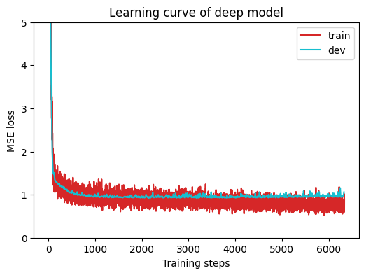
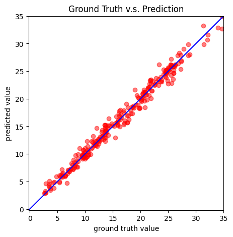
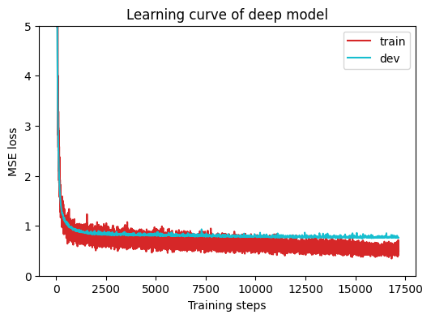
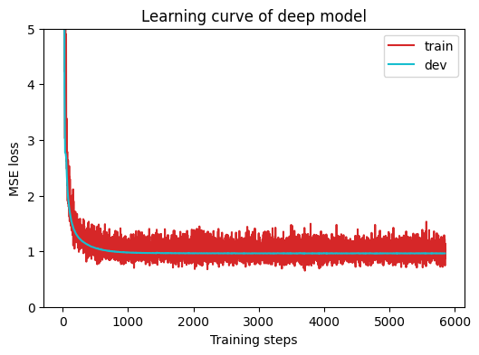
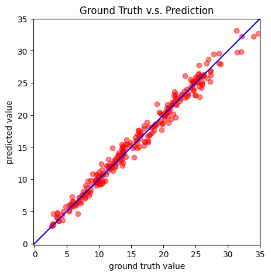

## 作業一

### 預備作業
我是使用 Google Colab GPU T4 的選項，這也是這堂課的好處之一，所有的作業都可以使用免費的雲端資源做完。像我這樣沒有厲害顯卡的也不用擔心。

在 import packages 的區塊可以看到上次提到的 [Data Set 與 DataLoader](https://miyaya.github.io/p/%E6%A9%9F%E5%99%A8%E5%AD%B8%E7%BF%920pytorch/#more-on-dataset-and-dataloader) 在這邊被引用了。

接著來逐行看程式碼的部分

```python
myseed = 42069  # set a random seed for reproducibility
torch.backends.cudnn.deterministic = True
torch.backends.cudnn.benchmark = False
np.random.seed(myseed)
torch.manual_seed(myseed)
if torch.cuda.is_available():
    torch.cuda.manual_seed_all(myseed)
```

這整段都在實現 DL 的「可重現性」。因為在訓練過程中，有很多地方會使用到隨機性，在實驗階段，將這些變因都固定中很重要！

PyTorch 底層在 GPU 上運算時，會使用 NVIDIA 的 cuDNN library 加速運算，為了效能會採用一些 non-deterministic 的計算順序，這邊設定成 `True` 強制 cuDNN 使用確定性演算法，以確保每次結果一致。

訓練一開始進行時，會先自動偵測測試許多種卷積演算法挑選最快的來用，但這也帶了一些隨機性。在此設定成 `False` 犧牲一點點的訓練速度來換取穩定的結果。

最後將 seed 餵給 `np` 以及 `torch` 在初始化、shuffle、採樣、dropout 的時候都可能可以用上。

### Dataset
首先要完成 `COVID19Dataset` 的 class，包含：讀取檔案、extract features、將train/dev/test分開、標準化 features。

要做的事情很簡單，大部分的程式都寫好了，這邊只需要加上一行，當我們不想使用整筆資料訓練，而是僅針對我們在意的資料去做訓練（這邊是 states 的 one-hot vector 以及 2 次 tested_positive 的欄位）。

```python
feats = list(range(1, 41)) + [57, 75]
```
去掉第 0 個 column 是 id，這邊就可以得到想要的欄位！這邊完成後，基本上就可以過 simple baseline。後面的神經網路最佳化部分才會針對 strong baseline 做調整！

接著 dataloader 會將我們準備好的資料準備成 batches。

### NN structure
進入神經網路的主體部分，這份神經網路針對「回歸」類型的題目設計，有兩個 fully-connected layers with ReLU activation。不考慮輸出層的話是 1 個 hidden layer，然後這層裡有 64 個神經元。

```python
class NeuralNet(nn.Module):
    ''' A simple fully-connected deep neural network '''
    def __init__(self, input_dim):
        super(NeuralNet, self).__init__()

        # Define your neural network here
        # TODO: How to modify this model to achieve better performance?
        self.net = nn.Sequential(
            nn.Linear(input_dim, 64),
            nn.ReLU(),
            nn.Linear(64, 1)
        )

        # Mean squared error loss
        self.criterion = nn.MSELoss(reduction='mean')
```

TODO 的部分，我們可以先嘗試加大！加深！

透過改變模型的 capacity 去實驗 training loss 以及 testing loss 的結果。如果訓練的 loss 降到很低，但測試的 loss 卡住甚至上升，那就代表有 overfitting 發生。另一方面若訓練的 loss 一直下不去，那可能代表 underfitting。

目前 simple baseline 的模型訓練結果為

```
Saving model (epoch =  450, loss = 0.9553)
Finished training after 651 epochs
```

將 TODO 的神經網路多加一層看看。

```python
self.net = nn.Sequential(
    nn.Linear(input_dim, 64),
    nn.ReLU(),
    nn.Linear(64, 32),
    nnReLU(),
    nn.Linear(32, 1)
)
```

此時，訓練過程得到
```
Saving model (epoch =  293, loss = 0.9593)
Finished training after 494 epochs
```

首先可以先釐清一個觀念，就是 **epoch 減少，不代表訓練變快了！**

回頭看 `train` 的內容，在每個 epoch 算完後會去計算 loss，如果該 epoch 的 loss 比之前的最佳紀錄還高的話，會 ++ 計數器，然後當這個計數器高於設定值的話就會停止訓練。所以更直白的解讀應該是「模型更快地不再進步了」。

可能的原因如下
- 差異太小，所以不足以顯著到值得作爲參考
- 模型變得比較複雜，所以 learning rate 以及 optimizer 可能也需要調整
- config 中的 early_stop 太小了，容忍值調大的話可能可以突破 loss 的平原期
- 需要搭配 normalization 以避免 overfit

#### training data

經過了各種崩潰的嘗試，我發現當前是資料的問題！

使用 states + 2 次 tested_positive 的資料，看來是不夠足以達到 medium baseline。因此我進去看資料並篩選我覺得有用的其他欄位，像是 `wearing_mask`(33, 62)、`travel_outside_state`(45, 63)、`work_outside_home`(46, 64)、`large_event`(50, 68)、`public_transit`(51,69)

同時我還把 `early_stop` 設成 `350`，此時的 loss 經過 704 個 epoch 得到 0.9219 的 loss 值！✨

 

> 終於喔！差點要放棄了！！

#### overfitting
如果想要解決 overfit，可以透過加上 dropout、做正規化等方法來修正。

**dropout**

```python
self.net = nn.Sequential(
    nn.Linear(input_dim, 128),
    nn.ReLU(),
    nn.Linear(128, 64),
    nn.ReLU(),
    nn.Dropout(0.2),
    nn.Linear(64, 32),
    nn.ReLU(),
    nn.Linear(32, 1)
)
```
dropout 會隨機將 20% 的神經元關閉，也就是設為 0。

在上面的例子🌰中，ReLU 輸出了 64 個數值，針對這 64 個值每個有 20% 的機率被重設成 0。剩下的數值會被放大 1.25 倍 (inverted dropout) 使得最終輸出的期望值不變。每一個 batch 關掉的神經元都會隨機重新抽。

這個方法使得每個 neuron 不能過度依賴旁邊特定的鄰居組合來得到正確答案，換句話說，dropout 相當於同時訓練了「非常多個共享權重的子網路」，最後做預測的時候等於是這些子網路的 ensemble，所以這比單一模型更不容易 overfit。

在較深、較大的網路可以用到 `dropout=0.5`，但也要注意若設得太大可能容易 underfitting，學不到 feature。

**normalization**

在訓練開始前，資料已經先做過一次性的標準化，使用 `BatchNorm1d` 則可以在網路內部、每一層之間動態的把每個 batch 都重新正規化。

```python
self.data[:, 40:] = \
    (self.data[:, 40:] - self.data[:, 40:].mean(dim=0, keepdim=True)) \
    / self.data[:, 40:].std(dim=0, keepdim=True)
```

當層數一多，某一層輸出的數值範圍可能因為前面權重更新而漂移 (internal covariate shift)， batch norm 讓每層拿到的輸入分布比較穩定，通常可以讓訓練更快收斂、更穩定。

`BatchNorm` 是算整個 batch 的平均值與標準差，所以 batch size > 1。且順序通常為 Linear → BatchNorm → ReLU → Dropout。


### 實驗結果

#### simple baseline (loss: 2.03004)  ✅
首先是拿整筆資料來訓練。

 

學習曲線看起來有點 overfitting (train 的尾聲表現比 dev 好蠻多的)。雖然如此，但 simple baseline 應該只要初步確保模型跑的出結果。

上傳 pred.csv 得到以下的成績

| public | private |
| ------ | ------- |
| 1.42385| 1.52802 |

算是輕鬆得到 <2.03 的成績！

#### medium baseline (loss: 1.28359)  ✅

透過改變 hyper parameters 先初步的將 `target_only` 設定為 `True` 讓資料只吃特定欄位。然後再 load 一次檔案再重新訓練。

此時應該要可以過 medium baseline。

 

可以看到 overfit 的情況相較於前一組訓練結果已經被改善了，但 loss 還是頗高。

上傳 pred.csv 得到以下的成績

| public | private |
| ------ | ------- |
| 1.03302| 1.04004 |

#### strong baseline (loss: 0.89266) ☹️

這邊我怎麼嘗試都沒有成功，像是改變 optimizer 與 learning rate，還有一點是作業描述中有提到一個 bug 需要被修正，這個部分我也沒有找到。

> ML 的實驗過程真是煎熬啊啊啊

那麼第一份作業的練習先到這邊告一段落，還有好多練習要完成呀～～
